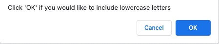

# mobill.js

## Description

Using primarily JavaScript, I created a password generator that adapts to the user's needs. The password generator will display a password of the user's choice between 8 and 128 characters in length, and will include at least one character type: :abcd: lower case , :capital_abcd: upper case , :symbols: symbols  or :1234: numbers  based on the user's choice.

No more reusing the same old password, this password generator will randomly generate a combination of lower case and/or upper case letters, as well as numbers and symbols should you wish to include it as part of your password criteria.

Go on and check out my [password generator](https://disantoz.github.io/mobill.js/)! 

## Usage

To beging the random password generator simply click on the red generate password button. You will first be prompted with selection the length of your password:

The password length must be between 8 and 128 characters long. Should the user enter any other number outside of 8 - 128 or even a word, the user will be presented with the following alert:

Once the user selects their desire length, they will be prompted with 4 questions, each quesiton confirming if the user would like to include a lower case letter, upper case letter, symbol, and/or number.

The user must select at least _one_** character type or they will be not be allowed to generate a password.

The final result will be a randomly generated password!

## License

MIT License

Copyright (c) [2021] [DiSantoz]

Permission is hereby granted, free of charge, to any person obtaining a copy
of this software and associated documentation files (the "Software"), to deal
in the Software without restriction, including without limitation the rights
to use, copy, modify, merge, publish, distribute, sublicense, and/or sell
copies of the Software, and to permit persons to whom the Software is
furnished to do so, subject to the following conditions:

The above copyright notice and this permission notice shall be included in all
copies or substantial portions of the Software.

THE SOFTWARE IS PROVIDED "AS IS", WITHOUT WARRANTY OF ANY KIND, EXPRESS OR
IMPLIED, INCLUDING BUT NOT LIMITED TO THE WARRANTIES OF MERCHANTABILITY,
FITNESS FOR A PARTICULAR PURPOSE AND NONINFRINGEMENT. IN NO EVENT SHALL THE
AUTHORS OR COPYRIGHT HOLDERS BE LIABLE FOR ANY CLAIM, DAMAGES OR OTHER
LIABILITY, WHETHER IN AN ACTION OF CONTRACT, TORT OR OTHERWISE, ARISING FROM,
OUT OF OR IN CONNECTION WITH THE SOFTWARE OR THE USE OR OTHER DEALINGS IN THE
SOFTWARE.

